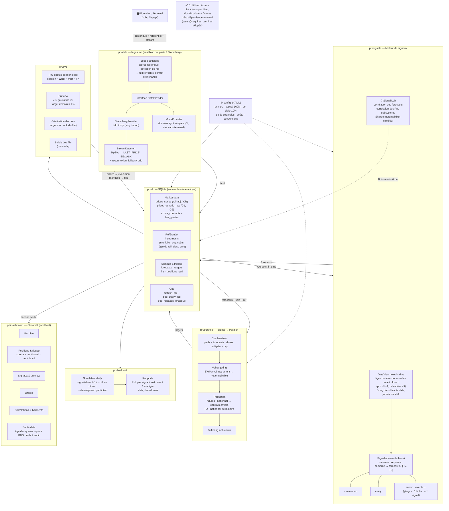

# PRT — Architecture des building blocks

## Règles de dépendance

1. **Bloomberg n'est touché que par `prt/data`** — tout le reste lit la DB. Le repo tourne intégralement sans terminal (MockProvider).
2. **La DB est le seul point de rencontre** — aucun bloc ne parle latéralement à un autre ; chaque bloc est autonome, testable seul, remplaçable.
3. **Backtest et live exécutent le même code** signaux + portfolio — seule la source des dates change.
4. **Le lag d'information vit dans la DataView** (knowledge time par type de donnée), jamais en aval — pas de `shift(1)` mécanique.
